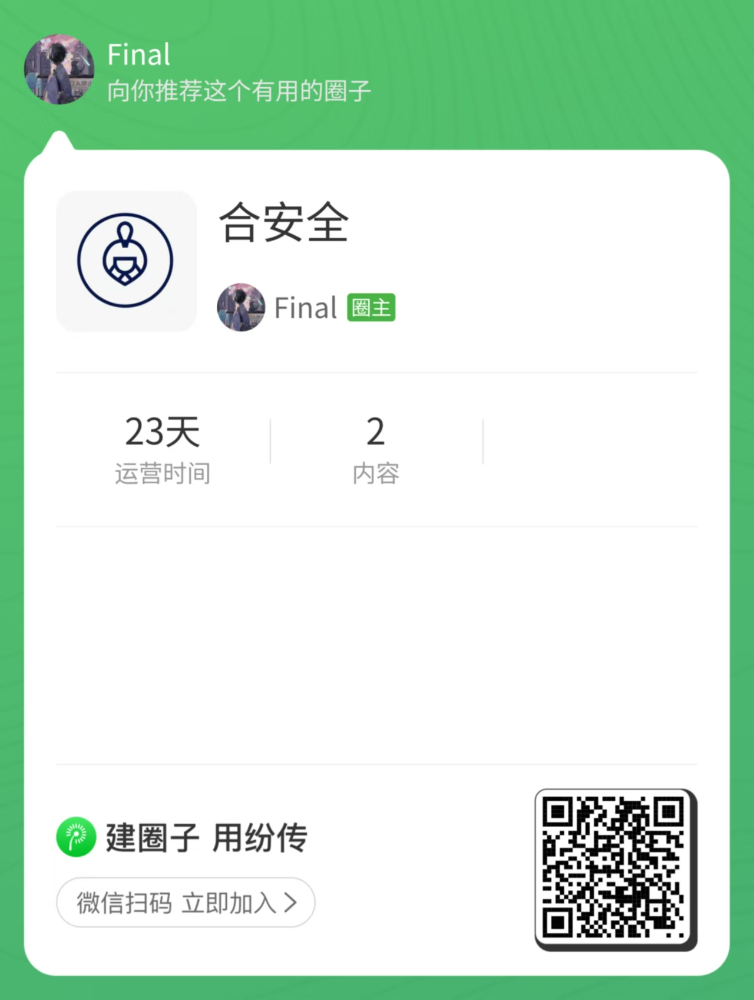

# ARL-ARM64-CentOS8

arm64 架构的 centos8 灯塔，可用于 mac 电脑使用 docker 的 centos8 或虚拟机本地搭建，本地已通过测试

## 修改

- 修复长时间任务一直扫描卡死问题
- 修复 fileleak 中断报错问题

## 源码安装

源码编译文件在 **build/arl.sh**
可国内一键安装

注意需要 git 到/opt 下

```
#拉docker再编译
docker pull finalhades/centos_8.5
docker run --privileged --cpus="6.0" --memory="8g" -it -d -p 5003:5003 --name=arl --restart=always  finalhades/centos_8.5 /usr/sbin/init
cd /opt
git clone https://github.com/RecoveryAshes/ARL-ARM64-CentOS8.git
./ARL-ARM64-CentOS8/build/arl.sh
```

## docker（可能需要国外）

```
docker pull finalhades/arl_arm64:latest
#docker cpus几核，memory内存
docker run --privileged --cpus="6.0" --memory="8g" -it -d -p 5003:5003 --name=arl --restart=always  finalhades/arl_arm64 /usr/sbin/init
```

免费圈子，还没想好发什么

