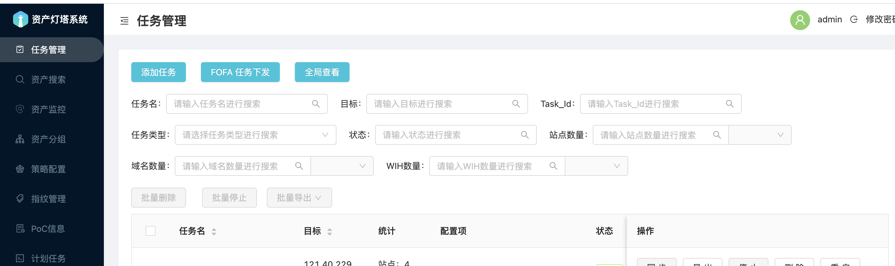
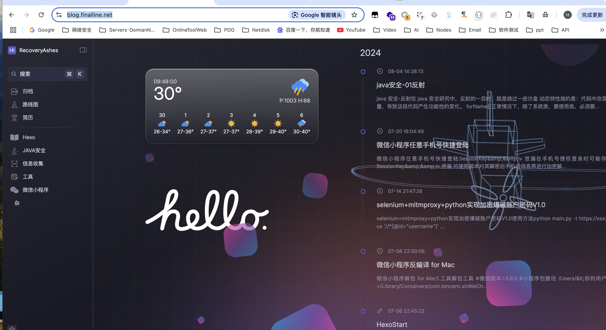

# ARL-ARM64-CentOS8

arm64 架构的 centos8 灯塔，可用于 mac 电脑使用  centos8 虚拟机本地搭建，本地已通过测试

账户密码admin/arlpass


## 修改优化

1. 文件泄露扫描优化

- 减少了 read_timeout 和 concurrency_count 的值，提高了效率。
- 使用更大的 chunk_size 提高了读取效率。
- 增加了重试机制，提高了稳定性。
- 更详细地处理了多种异常，包括网络异常和读取超时。
- 降低了错误阈值，避免因个别错误导致整个任务失败。

2. 修复长时间任务一直扫描卡死问题

## 源码安装

centos8,iso文件,随意虚拟机软件安装

```
https://www.123865.com/s/iYG0Vv-IApD3?提取码:AbSC
```

源码编译文件在 **build/arl.sh**
可国内一键安装

注意需要 git 到/opt 下

```
cd /opt
git clone https://github.com/RecoveryAshes/ARL-ARM64-CentOS8.git
./ARL-ARM64-CentOS8/build/arl.sh

#记得关闭防火墙，或自己做策略
systemctl stop firewalld
systemctl disable firewalld
```

## docker（无法使用）

macos的docker在大批量端口扫描时，docker到mac的端口流量会有阻塞，属于docker本身限制，暂时不知道如何解决

```
docker pull finalhades/arl_arm64:latest
#docker cpus几核，memory内存
docker run --privileged --cpus="6.0" --memory="8g" -it -d -p 5003:5003 --name=arl --restart=always  finalhades/arl_arm64 /usr/sbin/init
```

## 其他

### 免费知识分享纷传圈子


### 博客

https://blog.finalline.net/

